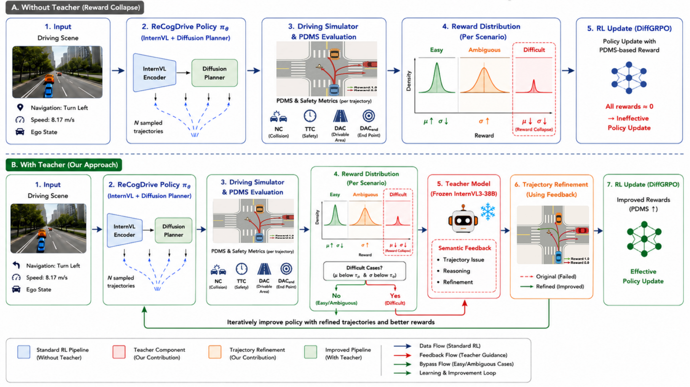

# Feedback-Guided Reinforcement Learning for Diffusion-Based Autonomous Driving

## Overview

<p align="center">
  
</p>

This repository presents **Feedback-Guided Reinforcement Learning** for diffusion-based autonomous driving. Building on top of a Vision-Language Model (VLM) backbone and a Diffusion Planner, we introduce a feedback-guided RL stage that further refines the planning policy using reward signals derived from driving metrics.

The pipeline consists of three stages:
1. **VLM Pretraining** — fine-tune InternVL on driving QA datasets
2. **Diffusion Planner Imitation Learning** — train a DiT-based trajectory planner using cached VLM hidden states
3. **Feedback-Guided RL Training** — apply reinforcement learning on the Diffusion Planner guided by PDM-based reward signals

---

## Installation

After downloading the NAVSIM dataset:

**1. For VLM Pretraining (Stage 1):**
```bash
pip install -r internvl_chat/internvl_chat.txt
```

**2. For Diffusion Planner Training & Evaluation (Stage 2 & 3):**
```bash
cd /path/to/repo
pip install -e .
```

---

## Training & Evaluation

### Stage 1: VLM Driving Pretraining

Download pretrained InternVL weights from HuggingFace:
- [InternVL3-2B](https://huggingface.co/OpenGVLab/InternVL3-2B)
- [InternVL3-8B](https://huggingface.co/OpenGVLab/InternVL3-8B)

Generate the ReCogDrive dataset on NAVSIM:
```bash
cd ./scripts
sh generate_dataset/generate_internvl_dataset.sh
sh generate_dataset/generate_internvl_dataset_pipeline.sh
```

Launch VLM fine-tuning:
```bash
cd internvl_chat
sh ./shell/internvl3.0/2nd_finetune/internvl3_8b_dynamic_res_2nd_finetune_recogdrive_pretrain.sh
```

---

### Stage 2: Diffusion Planner Imitation Learning

You can download our pretrained ReCogDrive VLM from [HuggingFace](https://huggingface.co/collections/owl10/recogdrive-68bafa143de172bab8de5752).

> ⚠️ Caching hidden states requires approximately **1–2 TB of disk space**.

**2B model:**
```bash
cd ./scripts
sh cache_dataset/run_caching_recogdrive_hidden_state.sh
sh training/run_recogdrive_train_multi_node_2b.sh
sh evaluation/run_recogdrive_agent_pdm_score_evaluation_2b.sh
```

**8B model:**
```bash
cd ./scripts
sh cache_dataset/run_caching_recogdrive_hidden_state_8b.sh
sh training/run_recogdrive_train_multi_node_8b.sh
sh evaluation/run_recogdrive_agent_pdm_score_evaluation_8b.sh
```

---

### Stage 3: Feedback-Guided RL Training

> ⚠️ Use **NumPy >= 1.26.4** to avoid errors during metric caching.

**2B model:**
```bash
cd ./scripts
sh cache_dataset/run_metric_caching_train.sh    # cache metrics for navtrain
sh cache_dataset/run_metric_caching.sh          # cache metrics for navtest
sh training/run_recogdrive_train_multi_node_rl_2b.sh
sh evaluation/run_recogdrive_agent_pdm_score_evaluation_2b.sh
```

**8B model:**
```bash
cd ./scripts
sh cache_dataset/run_metric_caching_train.sh
sh cache_dataset/run_metric_caching.sh
sh training/run_recogdrive_train_multi_node_rl_8b.sh
sh evaluation/run_recogdrive_agent_pdm_score_evaluation_8b.sh
```

---

### Training Without Feedback

To run RL training **without** the feedback-guided refinement (vanilla GRPO, no teacher model), use the no-feedback script:

```bash
cd ./scripts
sh training/run_recogdrive_train_multi_gpu_rl_no_feedback.sh
```

The key difference from feedback-guided training is that `teacher_model_path` and `feedback_lora_path` are left empty, so no failure-case refinement is applied during RL.

---

### Configuring the Feedback Trigger

The feedback mechanism is controlled by parameters in `navsim/planning/script/config/common/agent/recogdrive_agent.yaml` or passed directly as CLI overrides:

| Parameter | Default | Description |
|-----------|---------|-------------|
| `agent.failure_threshold` | `0.8` | PDM score below this value is treated as a failure and triggers feedback |
| `agent.num_refined_samples` | `4` | Number of refined trajectory samples generated by the teacher |
| `agent.teacher_model_path` | `''` | Path to the teacher VLM model |
| `agent.feedback_lora_path` | `''` | Path to the feedback LoRA weights |
| `agent.teacher_server_port` | `0` | Port for the teacher server (0 = disabled) |

To override at runtime, append to any training command:

```bash
sh training/run_recogdrive_train_multi_node_rl_2b.sh \
    agent.failure_threshold=0.7 \
    agent.num_refined_samples=8
```

---

### Visualization

**Trajectory score visualization** (BEV + camera view for a single scene):
```bash
cd ./scripts
sh visualization/plt_traj_score_one.sh
```

**Trajectory distribution visualization** (best/worst/GT trajectories from a dataset):
```bash
python visualize_traj_distribution.py
```
Edit the config block at the top of the file to point to your JSONL dataset and choose which difficulty types to visualize (`easy`, `ambiguous`, `difficult`).

---

## Acknowledgement

This project is built upon [ReCogDrive](https://github.com/xiaomi-research/recogdrive). We sincerely thank the authors for their excellent work and for open-sourcing their codebase.
